# Pure Storage Epic Tutorial

This tutorial illustrates a simple scenario of Windows users interacting with the Epic application. Users can seamlessly **import files into Epic** (e.g., PDF documents) and **export files from Epic** (e.g., CSV files) through a shared FlashArray-managed directory. This shared directory supports **multiprotocol access**, enabling communication via both an **NFSv3 mount** (for Epic application daemons on Linux servers) and an **SMB mapped drive** (for Windows users). The key objective is to demonstrate how Epic servers (Linux) and Windows users can collaboratively access and interact with the same share for reading and writing files.

---

## Step 1: Create Local Groups

1. Navigate to `Settings > Access > File Services` in the GUI.

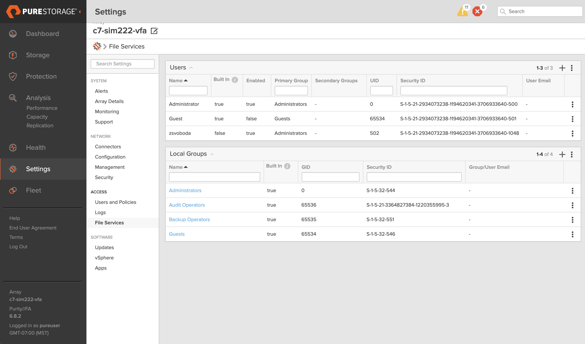

2. Create a new group by clicking on the 'plus' icon in the `Local Groups` widget.
3. Enter the following details:
   - **Name**: `epic_daemons`
   - **GID**: `1001`

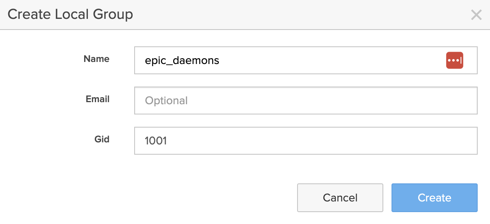
   
4. Repeat to create the second group:
   - **Name**: `windows_users`
   - **GID**: `1002`

---

## Step 2: Create Local Users
1. Navigate to `Settings > Access > File Services`.
2. Create a new user by clicking on the 'plus' icon in the `Users` widget.
3. Enter the following for the first user:
   - **Name**: `epic_daemon`
   - **Primary Group**: `epic_daemons`
   - Toggle the **Enabled** radio button to ON.
   - Set the new user's password and confirm it.
   - **UID**: `1001`

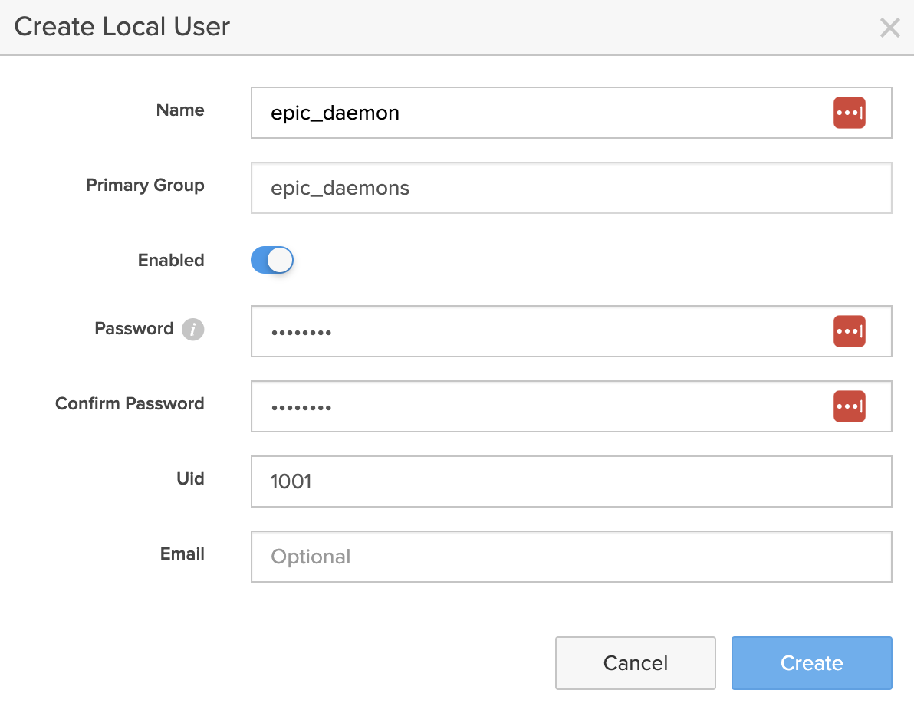

4. Repeat to create the second user:
   - **Name**: `windows_user`
   - **Primary Group**: `windows_users`
   - Toggle the **Enabled** radio button to ON.
   - Set the new user's password and confirm it.
   - **UID**: `1002`
---

## Step 3: Create a File System
1. Navigate to `Storage > File Systems`.

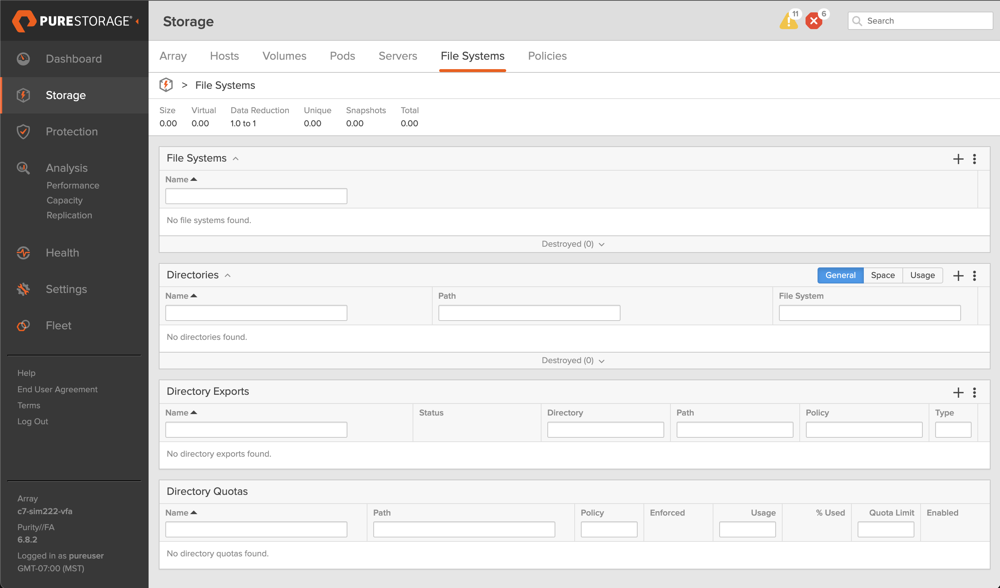

2. Create a new file system by clicking on the 'plus' icon in the `File Systems` widget.
3. Enter the following:
   - **Name**: `epic_file_system`

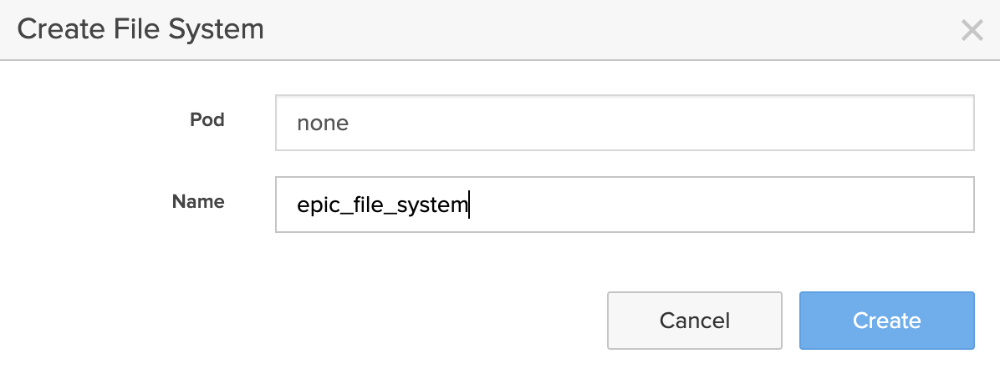

4. Confirm creation.

---

## Step 4: Create a Managed Directory
1. Navigate to `Storage > File Systems`.

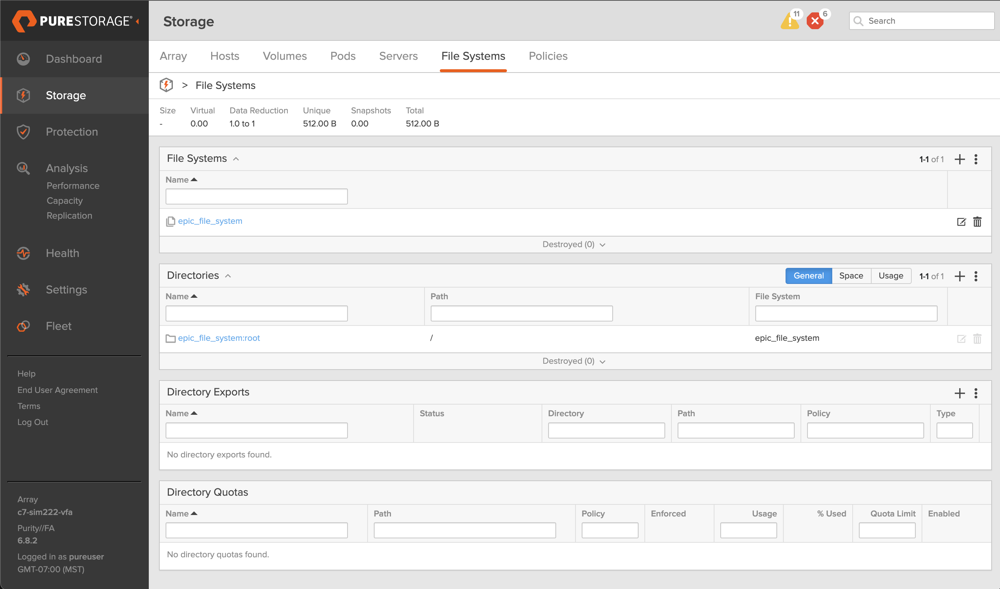

2. Create a new directory by clicking on the 'plus' icon in the `Directories` widget.
3. Configure the directory as:
   - **File System**: `epic_file_system`
   - **Name**: `epic_managed_directory`
   - **Path**: `/epic`

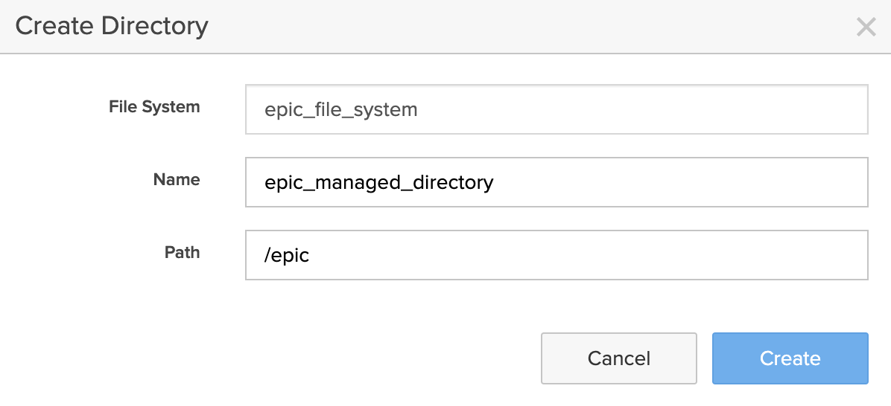

4. Confirm creation.

---

## Step 5: Create NFS Export Policy
1. Navigate to `Storage > Policies`.

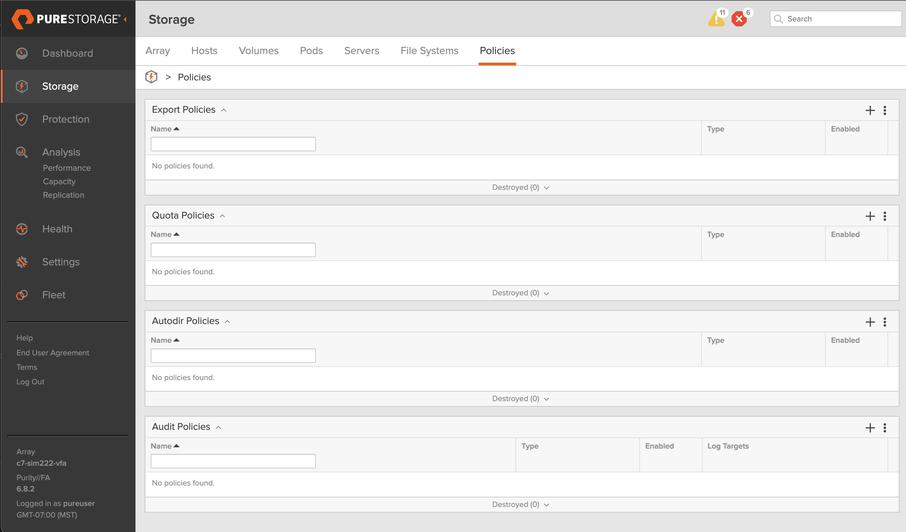

2. Create a new policy by clicking on the 'plus' icon in the `Export Policies` widget.
3. Configure the following:
   - **Type**: NFS
   - **Name**: `nfs_epic_daemon_access_policy`
   - Toggle the **Enabled** radio button to ON.
   - Toggle the **User Mapping Enabled** radio button to OFF.
   - **User Mapping**: Disabled

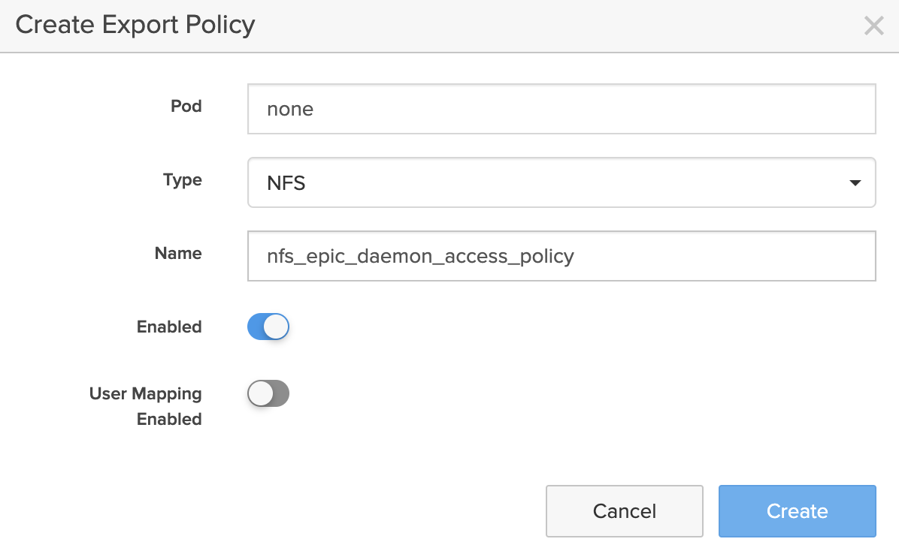

4. Confirm creation.   
5. Click on the newly created `nfs_epic_daemon_access_policy` policy link in the `Export Policies` widget.

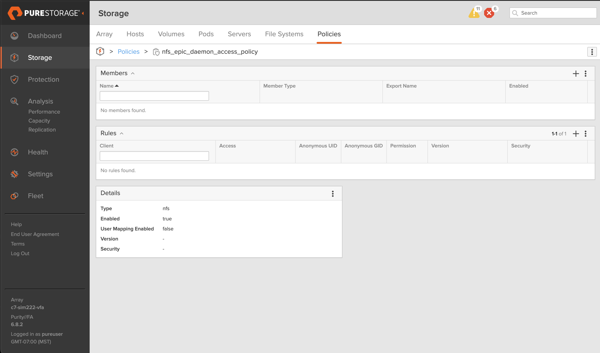

6. Create a new policy rule by clicking on the 'plus' icon in the `Rules` widget.
7. Configure the following:
   - **Client**: `*`
   - **Access**: Select the `all-squash` option.
   - **Anonymous UID**: `1001`
   - **Anonymous GID**: `1001`
   - **Permission**: Select the `rw` option.
   - **Version**: Select the `NFSv3` option. Leave the `NFSv4` option unselected.
   - **Security**: Select the `auth_sys` option. Leave all other options unselected.

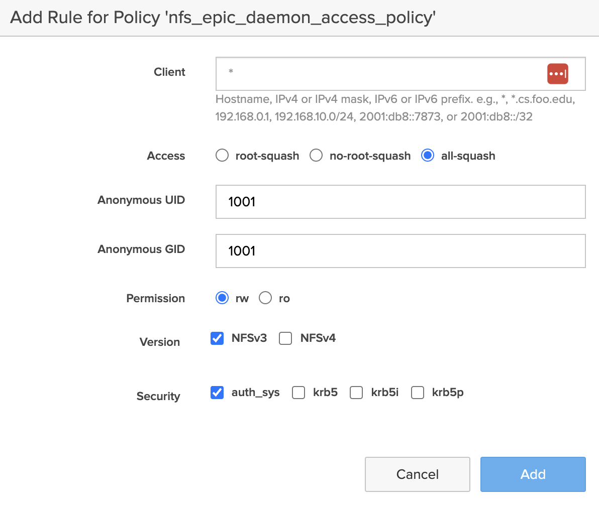
   
8. Confirm creation.   

---

## Step 6: Create SMB Policy
1. Navigate to `Storage > Policies`.
2. Create a new policy by clicking on the 'plus' icon in the `Export Policies` widget.
3. Configure the following:
   - **Type**: SMB
   - **Name**: `smb_epic_user_access_policy`
   - Toggle the **Enabled** radio button to ON.
   - Use defaults for other settings.

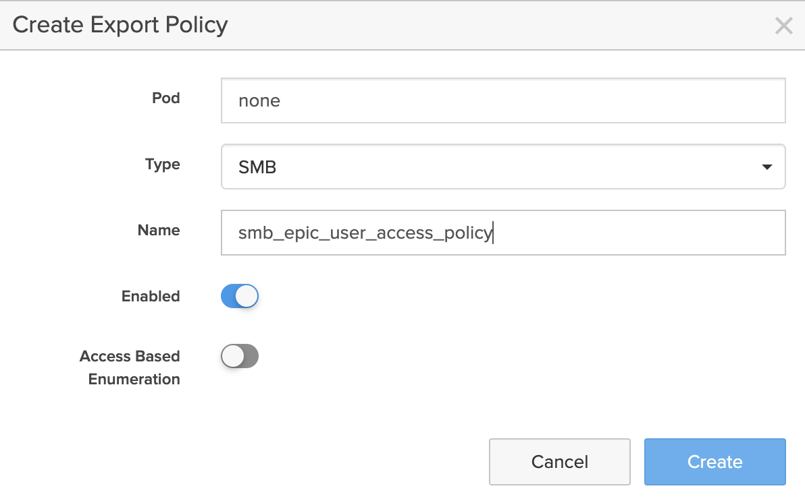

4. Add the rule to the SMB policy. Use the default settings.

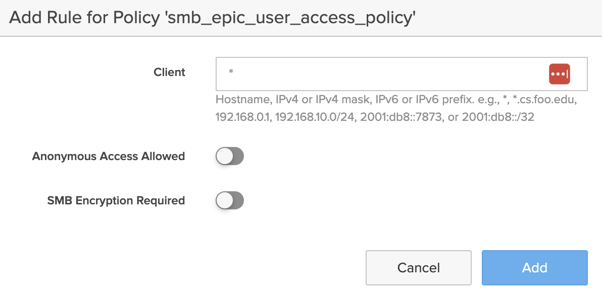

---

## Step 7: Export the Managed Directory
1. Navigate to `Storage > File Systems`.

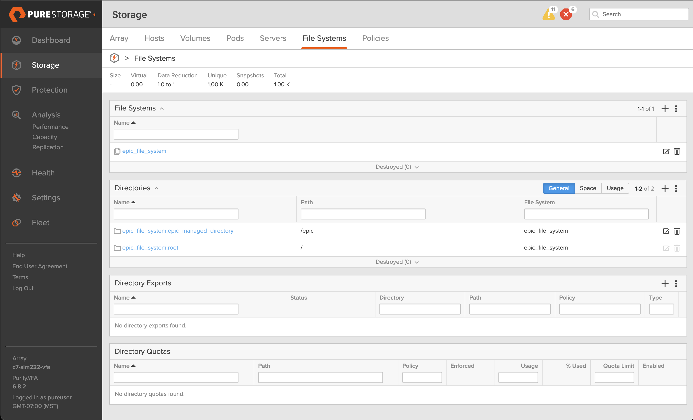

2. Create a new export by clicking on the 'plus' icon in the `Directory Exports` widget.

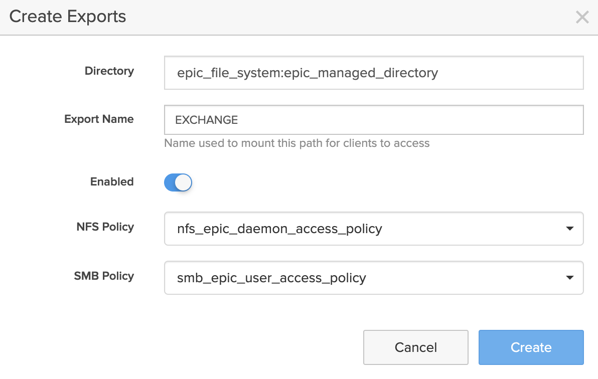

3. Configure the following:
   - **Directory**: Select the `epic_managed_directory`
   - **Export Name**: `EXCHANGE`
   - Toggle the **Enabled** radio button to ON.
   - **NFS Policy**: `nfs_epic_daemon_access_policy`
   - **SMB Policy**: `smb_epic_user_access_policy`

4. Confirm creation.  

---

## Step 8: Find the File Services Vrtual Network Interface (VIF) IP Address

First, find out your FlashArray's File Services virtual interface IP address: 

1. Navigate to `Settings > Network > Connectors` in the GUI.
2. Filter the network interfaces by type `vif` in the `Interfaces` widget.
3. Select the IP address of the interface with the `file` Services tag.

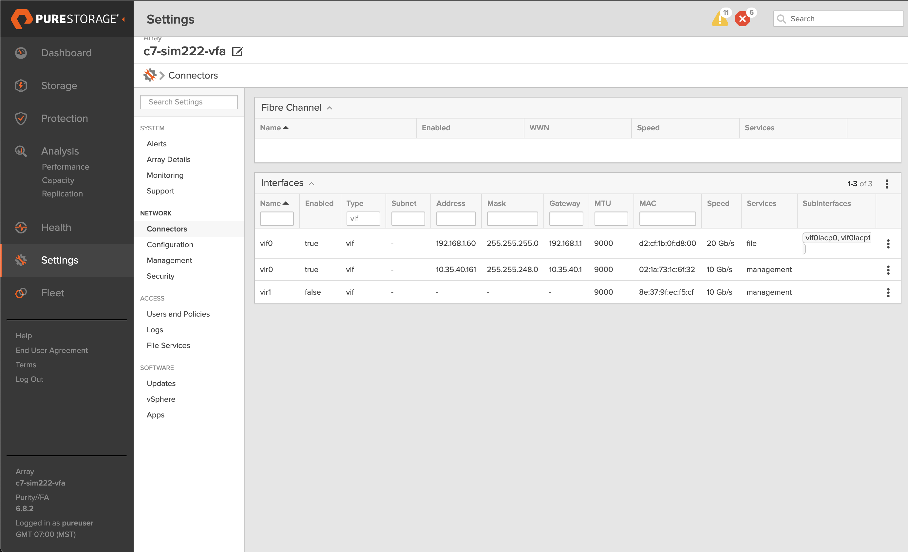

**NOTE**: We will use the IP address `192.168.1.60` as the File Services Virtual Interface IP in the following text. Pleasd replace this IP address with your VIF IP address. 

## Step 9: Mount the NFS Directory on Linux

The Linux machine represents the environment where the Epic application daemons are executed.

To set up the demo, we’ll start by mounting the FlashArray’s remote directory over NFS and creating the Epic import and export directories within the FlashArray’s export.

1. Create a mount point:

   ```bash
   sudo mkdir -p /mnt/epic
   ```

2. Mount the NFS share:
   
   ```bash
   sudo mount -t nfs -o nfsvers=3 192.168.1.60:/epic_managed_directory /mnt/epic
   ```

3. Create the Epic Import and Export Subdirectories

   ```bash
   sudo mkdir /mnt/epic/import /mnt/epic/export
   ```

4. Set the Directory Permissions

- Allow read/write for everyone on `import`:

   ```bash
   sudo chmod 777 /mnt/epic/import
   ```
- Allow read-write for owner/group and read-only for others on `export`:

   ```bash
   sudo chmod 774 /mnt/epic/export
   ```

---

## Step 10: Add Files

Next, we’ll simulate the Epic export functionality by creating a new file in the `export` directory.

1. In the `export` directory, create a file:

   ```bash
   echo "Exported CSV data" > /mnt/epic/export/export_demo.csv
   ```

---

## Step 11: Map SMB Share on Windows

The Windows machine represents the workstation of an Epic end user.

1. Open File Explorer.
2. Map a network drive using:

   - **Path**: `\192.168.1.60\epic_managed_directory`
   - **Credentials**: `domain\windows_user`

---

## Step 12: Verify End User's SMB Access

This step simulates an end user accessing a file exported by the Epic application.

1. Open the `export_demo.csv` file to ensure it is readable.

---

## Step 13: Upload End User's File from Windows

This step simulates an end user uploading a file to the Epic application.

1. Create a file `import_demo.txt` with content:

   ```text
   Document for import
   ```
2. Save it in the `import` directory.

---

## Step 14: Verify NFS Access from Linux

This step simulates the Epic application accessing the file uploaded by an end user.

1. On the Linux machine:

   ```bash
   cat /mnt/epic/import/import_demo.txt
   ```
   Confirm that the content is visible.

